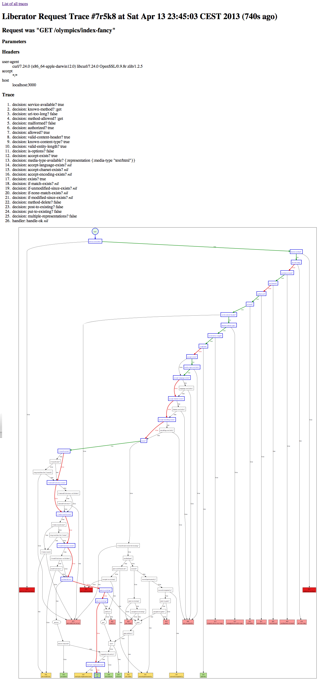

# Debugging the execution flow

Liberator encourages a declarative programming style: the developer is
hidden from the algorithm and only provides callbacks at certain
decision poinst. This enables a compact and powerful style of
programming but, in case of an unexpected result, can make debugging a
pain: there is no step through.

## Tracing with liberator.dev/wrap-trace

Altough the developer cannot step through the sequence of decisions,
liberator can be told to trace the execution and report to the
developer. The namespace ````liberator.dev```` contains helper
functions for this.

Let's take this example resource and trace it:



(def dbg-counter (atom 0))
(defresource dbg-resource
  :available-media-types ["text/plain"]
  :allowed-methods [:get :post]
  :handle-ok (fn [_] (format "The counter is %d" @dbg-counter))
  :post! (fn [_] (swap! dbg-counter inc)))  



To enable request tracing wrap the request handler in
````liberator.dev/wrap-trace````. You can wrap either a single
resource or any ring middleware stack. The later is recommented to
make the trace ui easily accessible:


(defroutes dbg
  (ANY "/dbg-count" [] dbg-resource))

(def handler
  (-> app
      (wrap-trace :header :ui)))


The response will include a complete trace of the sequence of
decisions together with the individual outcome:



$ curl -i http://localhost:3000/dbg-count
HTTP/1.1 200 OK
Date: Mon, 06 May 2013 08:23:11 GMT
X-Liberator-Trace: :decision (:service-available? true)
X-Liberator-Trace: :decision (:known-method? :get)
X-Liberator-Trace: :decision (:uri-too-long? false)
X-Liberator-Trace: :decision (:method-allowed? :get)
X-Liberator-Trace: :decision (:malformed? false)
X-Liberator-Trace: :decision (:authorized? true)
X-Liberator-Trace: :decision (:allowed? true)
X-Liberator-Trace: :decision (:valid-content-header? true)
X-Liberator-Trace: :decision (:known-content-type? true)
X-Liberator-Trace: :decision (:valid-entity-length? true)
X-Liberator-Trace: :decision (:is-options? false)
X-Liberator-Trace: :decision (:accept-exists? true)
X-Liberator-Trace: :decision (:media-type-available? {:representation {:media-type "text/plain"}})
X-Liberator-Trace: :decision (:accept-language-exists? nil)
X-Liberator-Trace: :decision (:accept-charset-exists? nil)
X-Liberator-Trace: :decision (:accept-encoding-exists? nil)
X-Liberator-Trace: :decision (:exists? true)
X-Liberator-Trace: :decision (:if-match-exists? nil)
X-Liberator-Trace: :decision (:if-unmodified-since-exists? nil)
X-Liberator-Trace: :decision (:if-none-match-exists? nil)
X-Liberator-Trace: :decision (:if-modified-since-exists? nil)
X-Liberator-Trace: :decision (:method-delete? false)
X-Liberator-Trace: :decision (:post-to-existing? false)
X-Liberator-Trace: :decision (:put-to-existing? false)
X-Liberator-Trace: :decision (:multiple-representations? false)
X-Liberator-Trace: :handler (:handle-ok)
Link: <//x-liberator/requests/xor3n>; rel=x-liberator-trace
X-Liberator-Trace-Id: xor3n
Vary: Accept
Content-Type: text/plain;charset=UTF-8
Content-Length: 16
Server: Jetty(7.6.1.v20120215)

The counter is 0



You can see that the media-type was negotiated and the decision
function returned a map with the representation definition. This map
was combined with the conext at that time and makes the media-type
available for the handler.

Also visible is that the part for conditional request was skipped. Try
playing around with resources that use ETags and different methods and
look how the request was processed. This will give you a good
understanding of how to implement a more sophisticated resource.

## Trace UI

When you payed attention you've noticed that we provided two additional
keyword arguments to wrap-trace: ````:header```` and ````:ui````. The
first let's liberator include the trace as response headers which is
nice in the console. Sometimes this is not enough or response
headers are not easily available. Liberator provides a web resource at
````/x-liberator/requests```` where a list of recent requests can be
found. The trace for a single request can be selected there.



<div class="alert alert-info">For the trace-ui to be accessible it is
mandatory that the wrapped handler is invoked for trace ui resource.
The simplest way to make this is to add wrap-trace to the stack of
ring middleware outside the routing. This is how it's done in the
above example.</div>

The trace ui shows for a single request the request including
parameters and headers, the trace of decisions and the decision graph.
It highlights the path that was taken for the request. The edges are
colored depending on the boolean value of the decision.